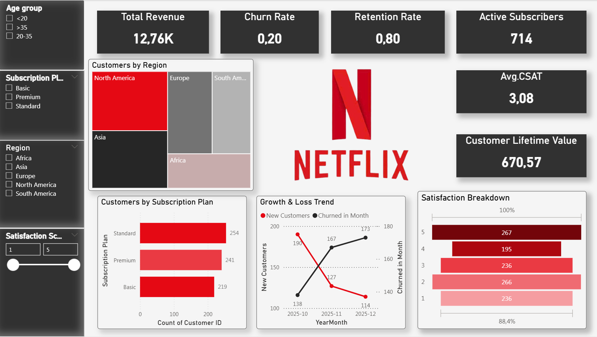
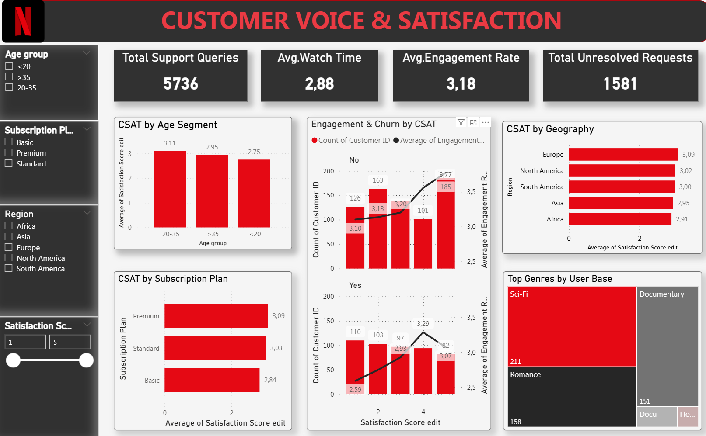
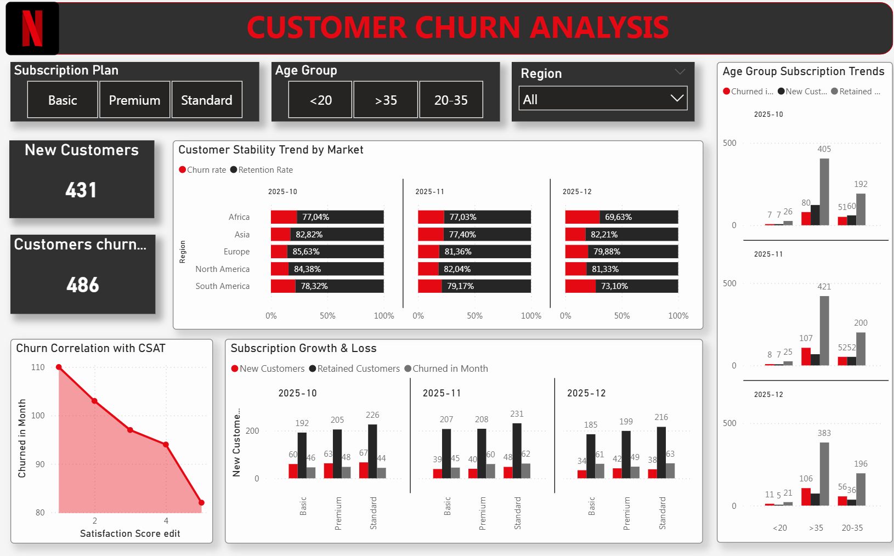
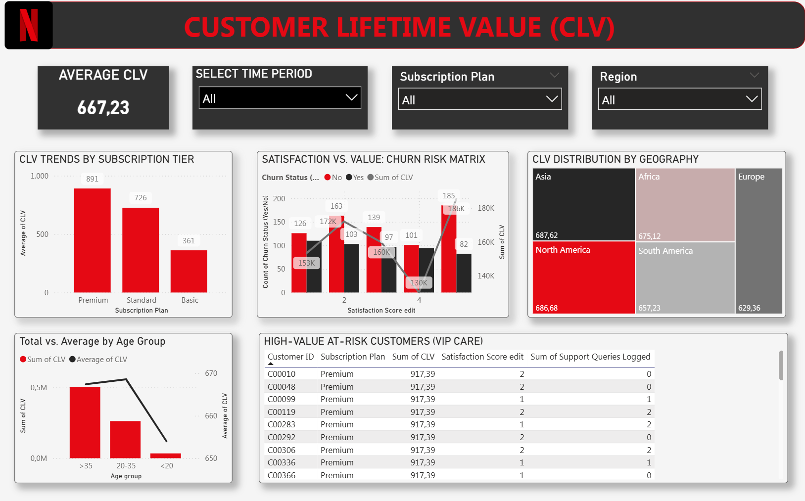

# CRM-Customer-Behaviour-Churn-Analysis
Analyze customer behavior and identify key factors affecting customer churn.
## 📌 Project Overview


This project analyzes customer behavior and churn patterns using Power BI. The objective is to identify factors influencing customer churn, evaluate customer engagement, and provide actionable business recommendations to improve customer retention and maximize customer lifetime value (CLV).


---


## 🎯 Business Problem


Customer churn significantly affects long-term business growth and profitability. This project aims to answer the following business questions:


- What is the overall customer churn rate?

- Which customer segments are most likely to churn?

- How do customer engagement and satisfaction influence churn?

- Which subscription plans generate the highest revenue?

- How can the company improve customer retention and drive revenue?


---


## 📂 Dataset


**Source:** Kaggle – Netflix large user Dataset


The dataset contains customer demographic information, subscription details, engagement metrics, and churn status.


### Key Features


- Customer ID

- Age

- Region

- Subscription Plan

- Monthly Charge

- Daily Watch Time

- Engagement Score

- Satisfaction Score

- Support Queries

- Payment History

- Churn Status


---


## 🧹 Data Preparation


Data preparation was performed using **Microsoft Excel**.


### Data Cleaning


- Removed duplicate records

- Handled missing values

- Standardized categorical values

- Corrected data types

- Checked data consistency


### Feature Engineering


Additional business metrics were created to support analysis:


- Customer Lifetime Value (CLV)

- Total Revenue

- Quarterly Revenue

- Customer Tenure


---


## 📊 Dashboard


The dashboard was developed in **Power BI** and consists of four analytical pages.


### 📄 Page 1 – Executive Overview


Provides a high-level summary of business performance.


**Key KPIs**


- Total Customers

- Active Customers

- Churn Rate

- Revenue

- Customer Lifetime Value (CLV)


---


### 📄 Page 2 – Customer Behaviour


Analyzes customer engagement and usage patterns.


Main analyses include:


- Daily Watch Time

- Engagement Rate

- Satisfaction Score

- Device Usage

- Genre Preference


---


### 📄 Page 3 – Churn Analysis


Focuses on customer churn trends and risk factors.


Visualizations include:


- Churn by Subscription Plan

- Churn by Region

- Churn by Age Group

- Monthly Churn Trend

- Churn vs Satisfaction


---


### 📄 Page 4 – Customer Value


Evaluates customer profitability and revenue contribution.


Main analyses include:


- Revenue by Subscription Plan

- Customer Lifetime Value

- Revenue Trend

- High-value Customer Segments


---


## 💡 Key Insights


- Premium customers generated the highest revenue and customer lifetime value.

- Customers with lower engagement rates were more likely to churn.

- Lower satisfaction scores were associated with higher churn rates.

- Monthly subscription plans experienced higher churn compared to longer-term plans.

- Customers who frequently contacted customer support showed a higher risk of churn.


---


## 📌 Business Recommendations


Based on the analysis, the following recommendations are proposed:


- Improve retention strategies for Premium customers through personalized loyalty programs.

- Increase customer engagement with targeted campaigns and personalized content.

- Enhance customer support quality to improve customer satisfaction.

- Encourage customers to switch from monthly to annual subscription plans.

- Monitor low-engagement customers proactively to reduce churn risk.


---


## 🛠 Tools Used


- Microsoft Excel (Data Cleaning & Preparation)

- Power BI (Data Modeling & Dashboard Development)


---


## 📁 Project Structure


```

CRM-Customer-Behaviour-Churn-Analysis/

│

├── data/

│   ├── raw/

│   └── processed/

│

├── dashboard/

│   ├── CRM_Customer_Behaviour.pbix

│   ├── overview.png

│   ├── customer_behaviour.png

│   ├── churn_analysis.png

│   └── customer_value.png

│

├── docs/

│

├── README.md

└── LICENSE

```


---


## 📷 Dashboard Preview


### Executive Overview





### Customer Behaviour





### Churn Analysis





### Customer Value





---


## 🌐 Live Dashboard


Interactive dashboard available on **NovyPro**:


> *(Add your NovyPro link here after publishing.)*


---


## 📈 Skills Demonstrated


- Business Analysis

- Data Cleaning

- Data Preparation

- Feature Engineering

- KPI Design

- Data Visualization

- Customer Analytics

- Churn Analysis

- Customer Lifetime Value (CLV)

- Business Insight Generation

- Power BI Dashboard Development


---
